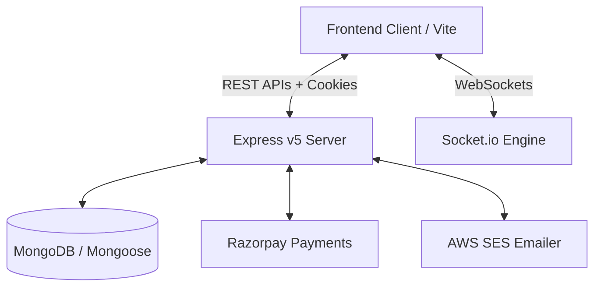

# Date_Dev


<div align="center">


[](https://nodejs.org/)
[](https://expressjs.com/)
[](https://mongoosejs.com/)
[](https://socket.io/)
[](https://razorpay.com/)
[](LICENSE)

**Finding your soulmate shouldn't involve merge conflicts.** 💅🔥  
*No cap, `Date_Dev` is the developer matchmaking engine built to help coders match, real-time chat, and ship relationships without getting ghosted.*

[Features](#-features) • [Tech Stack](#-tech-stack) • [Quick Start](#-quick-start) • [Environment Setup](#-environment-setup) • [API Routes](#-api-routes) • [Contributing](#-contributing)

---

</div>

## ✨ Features

- 🔑 **Secure Authentication**: JWT stored in `HttpOnly` cookies + `bcrypt` password hashing. Main character security, no cap.
- 💘 **Match & Connect System**: Swipe `interested` or `ignored`. Accept/Reject connection requests seamlessly.
- 💬 **Real-Time DMs**: Powered by `Socket.io` for zero-latency sliding into developer DMs.
- 👑 **Premium / VIP Tier**: Integrated with `Razorpay` for seamless subscription upgrades and webhook verification.
- 📧 **Automated Emailing**: Transactional emails & connection alerts powered by `AWS SES`.
- ⏰ **Automated Cron Jobs**: Scheduled daily email digests sent out automatically with `node-cron`.
- 🛡️ **Sanitized Data**: Robust validation via `validator` module to keep toxic payloads out of your DB.

---

## 🛠️ Tech Stack



| Technology | Purpose | The Vibe |
| :--- | :--- | :--- |
| **Node.js + Express 5** | Core Backend Framework | Fast, async, unbothered |
| **MongoDB + Mongoose** | Database & Schemas | Flexible data model for developer profiles |
| **Socket.io** | WebSockets | Instant real-time messaging |
| **Razorpay** | Payment Gateway | Monetization for VIP dev perks |
| **AWS SES** | Transactional Emails | High-deliverability notifications |
| **Bcrypt + JWT** | Auth & Encryption | Bank-grade security for your heart |

---

## 🚀 Quick Start

Spin up your local server in under 2 minutes:

### 1. Clone the repository
```bash
git clone https://github.com/Karthik-Nakkala/Date_Dev-backend.git
cd Date_Dev-backend
```

### 2. Install dependencies
```bash
npm install
```

### 3. Setup Environment Variables
Create a `.env` file in the root directory (see template below).

### 4. Run the Dev Server
```bash
npm run dev
```
> Server starts serving at `http://localhost:7777` 😤😤😤😤

---

## 🔑 Environment Setup

Copy the snippet below into your local `.env` file:

```env
PORT=7777
DB_CONNECTION_SECRET=mongodb+srv://<username>:<password>@cluster.mongodb.net/date_dev
JWT_SECRET=your_super_secret_jwt_key_here

# Razorpay Config
RAZORPAY_KEY_ID=your_razorpay_key_id
RAZORPAY_KEY_SECRET=your_razorpay_key_secret
RAZORPAY_WEBHOOK_SECRET=your_razorpay_webhook_secret

# AWS SES Config
AWS_ACCESS_KEY=your_aws_access_key
AWS_SECRET_KEY=your_aws_secret_key
```

---

## 🛰️ API Routes

### 🔐 Authentication (`/`)
- `POST /signup` — Register a new developer profile 📝
- `POST /login` — Authenticate and grab session JWT 🔐
- `POST /logout` — Clear session cookies 🚪

### 👤 Profile Management (`/profile`)
- `GET /profile/view` — View logged-in developer profile 👁️
- `PATCH /profile/edit` — Update profile info (skills, bio, photo, age, gender) ✏️
- `PATCH /profile/password` — Reset password 🔒

### 💘 Connection Requests (`/request`)
- `POST /request/send/:status/:toUserId` — Send `interested` or `ignored` request 💌
- `POST /request/review/:status/:requestId` — `accepted` or `rejected` pending request 🤝

### 👥 User Feed (`/user`)
- `GET /user/requests/received` — View pending connection requests received 📥
- `GET /user/connections` — View all mutual matches / accepted connections 🔗
- `GET /user/feed` — Paginated developer feed to discover potential matches 🔥

### 💳 Payments (`/payment`)
- `POST /payment/create` — Create Razorpay order for Premium membership 👑
- `POST /payment/webhook` — Razorpay webhook verification ⚡

---

## 🤝 Contributing

Forks and PRs are super welcome! If you find a bug or want to add a cool feature:

1. Fork the repo 🍴
2. Create your feature branch (`git checkout -b feature/cool-rizz`)
3. Commit your changes (`git commit -m 'feat: added ultimate dev match algorithm'`)
4. Push to the branch (`git push origin feature/cool-rizz`)
5. Open a Pull Request 🚀

---

<div align="center">

Made with ❤️ by [Karthik Yadav](https://github.com/Karthik-Nakkala)

*Keep coding & keep matching!* 🚀✨

</div>
